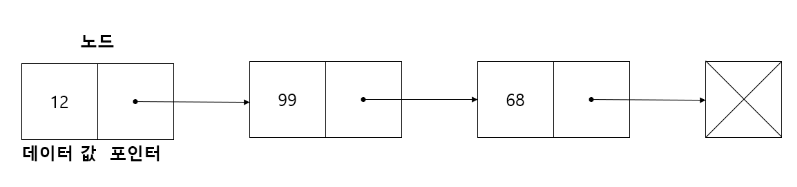
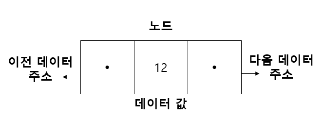

#  링크드 리스트(Linked List)

### 링크드 리스트

떨어진 곳에 존재하는 데이터를 화살표로 연결해서 관리하는 데이터 구조.

미리 연결된 공간을 예약해야 하는 배열의 단점을 극복한 자료구조. 

 

#### **[기본 구조 및 용어]**

현재 데이터와 다음 데이터의 주소값을 같이 가지고 있음.

노드(Node) : 데이터 저장 단위(데이터 값, 포인터)로 구성

포인터(Pointer) : 각 노드 안에서 다음이나 이전의 노드와의 연결 정보를 가지고 있는 공간

 

맨 앞에 있는 노드(head)의 주소만 알 수 있으면 전체의 주소값을 알 수 있음.


#### **[장•단점]**

장점

- 미리 데이터 공간을 할당할 필요 없음(<-> 배열)

단점

- 별도의 데이터 공간(포인터)이 필요, 저장 공간 효율이 안 좋음.
- 연결 정보를 찾는 시간이 필요, 접근 속도 느림
- 중간 데이터 삭제 시, 앞 뒤 데이터의 연결을 재구성해야 하는 부가적인 작업 필요


#### **[더블 링크드 리스트]**



항상 앞에서부터 검색을 해야하는 링크드 리스트의 단점을 보완한 리스트


#### **[링크드 리스트 구현]**

```python
class Node: # 노드 생성
	def __init__(self, data, next=None):
    	self.data = data
        self.next = next

class NodeMgmt: # 링크드 리스트를 관리
	def __init__(self, data):
    	self.head = Node(data) # 가장 처음 노드 설정
    
    def add(self, data): # 노드 추가 함수
    	if self.head == ' ':
        	self.head = Node(data)
        else:
        	node = self.head
            while node.next: # 제일 마지막 노드 다음에 추가 해야하기 때문에 마지막 노드 찾기
            	node = node.next
            node.next = Node(data) # 지금 추가할 노드 새로 생성
    
    def desc(self): # 순회, 전체 노드를 출력
    	node = self.head
        while node:
        	print(node.data)
            node = node.next
            
    def delete(self, data):
    	if self.head == ' ':
        	print("해당 값을 가진 노드가 없습니다.")
            return
            
        # head 삭제하는 경우
        if self.head.data == data:
        	temp = self.head
            self.head = self.head.next # 다음 노드를 head로 바꿔줌.
            del temp
            
        # 나머지(중간, 마지막) 삭제하는 경우
        else:
        	node = self.head
            while node.next:
            	if node.next.data == data:
                	temp = node.next
                    node.next = node.next.next
                    del temp
                    return
                else:
                	node = node.next
```

