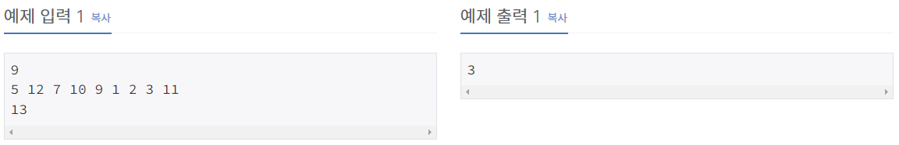
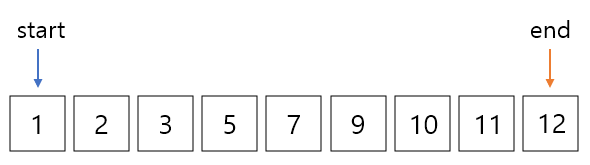
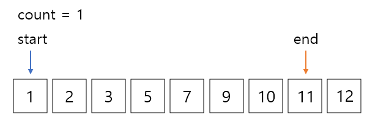
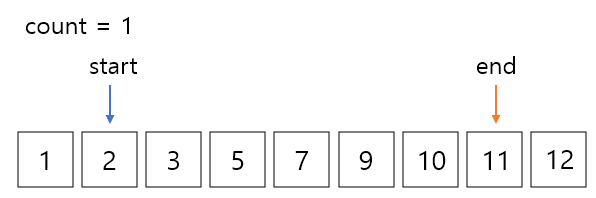

투 포인터(Two Pointers) 알고리즘

투 포인터란?

1차원 배열에서 각자 다른 원소를 가리키고 있는 2개의 포인터를 조작해가면서 원하는 답을 얻는 알고리즘이다.

이 알고리즘은 주로 언제 쓰면 좋을까?

알고리즘 문제를 완전탐색으로 풀었을 때, 시간초과가 나면 하나의 대안으로 투 포인터 알고리즘을 쓸 수 있다.

자세한 활용 방벙은 BOJ 3273번. 두 수의 합을 통해 자세히 알아보자.

## 문제

n개의 서로 다른 양의 정수 a1, a2, ..., an으로 이루어진 수열이 있다. ai의 값은 1보다 크거나 같고, 1000000보다 작거나 같은 자연수이다. 자연수 x가 주어졌을 때, ai + aj = x (1 ≤ i < j ≤ n)을 만족하는 (ai, aj)쌍의 수를 구하는 프로그램을 작성하시오.

입력

첫째 줄에 수열의 크기 n이 주어진다. 다음 줄에는 수열에 포함되는 수가 주어진다. 셋째 줄에는 x가 주어진다. (1 ≤ n ≤ 100000, 1 ≤ x ≤ 2000000)

출력

문제의 조건을 만족하는 쌍의 개수를 출력한다.




이 문제를 처음에 봤을 때 가장 먼저 완전 탐색방법이 떠오른다. 배열을 이중 반복문을 돌려 모든 쌍을 탐색하며 조건에 맞는 답을 찾는 방법이다.

```python
import sys
input = sys.stdin.readline

n = int(input())
arr = list(map(int, input().split()))
m = int(input())
arr.sort()

count = 0
sum = 0

for i in range(n):
    for j in range(i, n):
        sum = arr[i] + arr[j]
        if sum == m:
            count += 1

print(count)
```

하지만 이 방법은 시간초과가 뜬다. 이중 반복문을 이용하는 경우 시간복잡도가 O(n^2)이 되는데 이 문제의 경우 최악의 상황을 생각했을 때, 수열의 크기가 백만까지라 이중 반복문이면 백만 * 백만, 얼핏 계산해도 시간초과가 나올 수 밖에 없는 코드이다.

이때 투포인터 알고리즘을 쓰면 시간 복잡도가 확연히 줄어든다.

```python
import sys
input = sys.stdin.readline

n = int(input())
arr = list(map(int, input().split()))
m = int(input())
arr.sort()

count = 0
sum = 0
start, end = 0, n - 1

while start < end:
    sum = arr[start] + arr[end]
    if sum == m:
        count += 1
    if sum < m:
        start += 1
        continue
    end -= 1

print(count)
```

위의 코드를 간단하게 그림으로 알아보자.

일단 정렬을 먼저 하고 시작한다. start와 end 두개의 포인터를 리스트의 시작점과 끝점을 가리키게 정의한다.



start 값과 end 값의 합이 13이기 때문에 count는 1이되고 end를 왼쪽으로 한칸 이동해준다.



여기서 start 값과 end 값의 합은12로 13보다 작기 때문에 start를 오른쪽으로 한칸 이동해준다.



이런 방식으로 계속 진행하다보면 언젠가 start와 end값이 만나게 되고 while문을 벗어나 코드가 종료된다.

**투 포인터 알고리즘을 활용하면 리스트를 한 번만 탐색하기 때문에, 리스트가 이미 정렬되어 있는 경우 O(n), 정렬되어 있지 않더라도 O(nlongn)정도의 시간 복잡도를 가진다.**

번외로 투 포인터 알고리즘은 위의 방식처럼 리스트의 시작점과 끝점에 포인터를 둘 수도 있고, 시작점에 두 포인터를 같이 둘 수 도 있다. 문제에 따라 편한 방식으로 적용하면 될 것 같다. 

데이터의 크기가 크고 완전 탐색을 적용했을 때 시간초과가 뜬다면, 투 포인터 알고리즘을 활용해보자!!